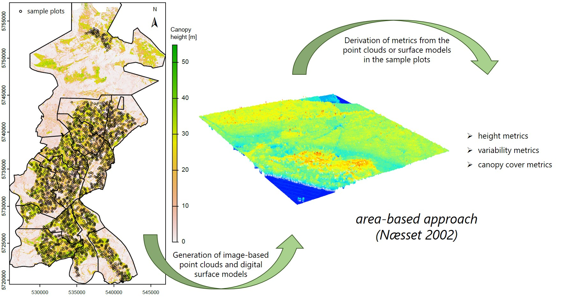

# timber-volume-model
Modeling timber volume on terrestrial sample plots.

## Description

Sustainable and productive forest management essentially requires information on the spatial distribution of timber volume (or growing stock). In the context of frequent biotic and abiotic calamities, these data are particularly valuable with respect to planning issues such as harvesting, forest regeneration, forest protection interventions or nature conservation activities.

Here, a model is developed to predict timber volume or the growing stock, respectively. It uses several metrics derived from remote sensing data as predictor variables that are suitable for modeling timber volume. The remote sensing data employed include image-based point clouds and digital surface models (DSM) or normalized digital surface models (nDSM, also called canopy height model (CHM)) derived from them. Two methods are compared:

- using normalized point clouds for forest metrics calculation
- using nDSMs for forest metrics calculation

The metrics calculated based on these two remote sensing products are compared to identify potential differences.

The timber volume is calculated from terrestrially gathered tree attributes in sample plots and serves as response variable.

*Chart illustrating the derivation of remote sensing metrics.*

## Further information about the topic

Goodbody, T.R.H., Coops, N.C., and White, J.C. (2019). Digital Aerial Photogrammetry for Updating Area-Based Forest Inventories: A Review of Opportunities, Challenges, and Future Directions. *Curr. For. Rep.* 5(2), pp. 55-75. <https://doi.org/10.1007/s40725-019-00087-2>.

Næsset, E. (2002). Predicting forest stand characteristics with airborne scanning laser using a practical two-stage procedure and field data. *	Remote Sens. Environ.* 80(1), pp. 88-99. <https://doi.org/10.1016/S0034-4257(01)00290-5>.

Stepper, C., Straub, C., and Pretzsch, H. (2015). Using semi-global matching point clouds to estimate growing stock at the plot and stand levels: application for a broadleaf-dominated forest in central Europe. *Can. J. For. Res.* 45(1), pp. 111-123. <https://doi.org/10.1139/cjfr-2014-0297>.

White, J.C., Coops, N.C., Wulder, M.A., Vastaranta, M., Hilker, T., and Tompalski, P. (2016). Remote Sensing Technologies for Enhancing Forest Inventories: A Review. *Can. J. Remote Sens.* 42(5), pp. 619-641. <https://doi.org/10.1080/07038992.2016.1207484>.

