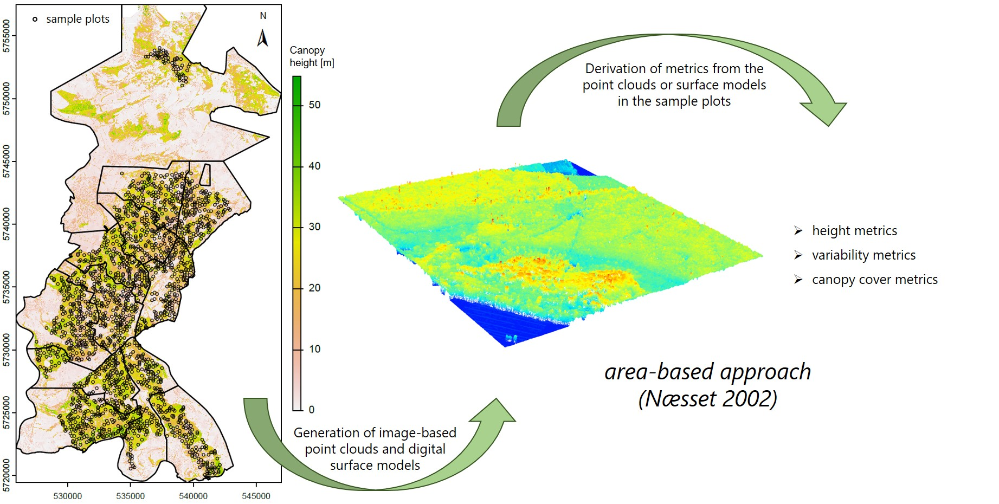

# timber-volume-model
Modeling timber volume on terrestrial sample plots.

## Description

Sustainable and productive forest management essentially requires information on the spatial distribution of timber volume (or growing stock). In the context of frequent biotic and abiotic calamities, these data are particularly valuable with respect to planning issues such as harvesting, forest regeneration, forest protection interventions or nature conservation activities.

Here, a Random Forest model is used to predict timber volume (growing stock) from metrics derived from normalized image-based point clouds. The point cloud metrics are used as predictor variables, and forest type information (deciduous vs. coniferous) from the [Copernicus High Resolution Layer Forest Type](https://sdi.eea.europa.eu/catalogue/srv/api/records/77873ff3-4edf-48d4-94cd-c5b7b61da29e?language=all) is included as an additional predictor.

The timber volume is calculated from terrestrially gathered tree attributes in sample plots and serves as response variable.

In addition to wall-to-wall prediction, the workflow includes small-area estimation for Reviere using direct, model-based, and model-assisted (GREG) approaches. For further information see Rao & Molina (2015).


*Chart illustrating the derivation of remote sensing metrics.*

## Folder structure

The project follows a structured organization for data, functions, and analysis scripts. Execute `src/setup.R` to automatically create the required base folder structure.

```
timber-volume-model/
├── data/
│   ├── raw_data/
│   │   ├── BI/                                  # Terrestrial inventory tables (sample points and trees)
│   │   ├── orga/                                # Administrative forestry boundaries (WEFL, Reviere)
│   │   └── tree_species/                        # CLMS forest type raster tiles
│   ├── processed_data/
│   │   ├── nDSMs_laz_solling/                   # Normalized point clouds used for metric extraction
│   │   └── ...                                  # Intermediate/model-ready datasets generated by scripts
│   └── metadata/                                # Metadata and documentation files
├── src/                                         # Reusable setup and processing functions
│   ├── setup.R                                  # Creates folder structure, defines data paths, loads packages
│   ├── format_data.R                            # Harmonizes BI table column names
│   ├── d_corr_func.R                            # Functions for species-dependent DBH correction
│   ├── ehk_func.R                               # Height imputation via Einheitshoehenkurve (EHK)
│   └── calc_metrics.R                           # Point cloud metric computation
├── scripts/                                     # Analysis and processing workflows
│   ├── 01_vol_sample_plots.R                    # Derives timber volume per terrestrial sample plot
│   ├── 02_forest_metrics.R                      # Computes plot/pixel forest metrics and adds forest type
│   ├── 03_model_train.R                         # Trains and evaluates the final RF growing stock model
│   ├── 04_prediction.R                          # Predicts wall-to-wall growing stock and links predictions to plots
│   └── 05_small_area_estimation.R               # Direct, model-based and GREG small-area estimation (Reviere)
├── docs/                                        # Figures and additional documentation
└── output/                                      # Result exports (e.g. global_rf_prediction.tif, small-area tables)
```

## Further information about the topic

Goodbody, T.R.H., Coops, N.C., and White, J.C. (2019). Digital Aerial Photogrammetry for Updating Area-Based Forest Inventories: A Review of Opportunities, Challenges, and Future Directions. *Curr. For. Rep.* 5(2), pp. 55-75. <https://doi.org/10.1007/s40725-019-00087-2>.

Næsset, E. (2002). Predicting forest stand characteristics with airborne scanning laser using a practical two-stage procedure and field data. *Remote Sens. Environ.* 80(1), pp. 88-99. <https://doi.org/10.1016/S0034-4257(01)00290-5>.

Rao, J.N.K. & Molina, I. (2015). Small Area Estimation. John Wiley, Hoboken. <https://doi.org/10.1002/9781118735855>

Stepper, C., Straub, C., and Pretzsch, H. (2015). Using semi-global matching point clouds to estimate growing stock at the plot and stand levels: application for a broadleaf-dominated forest in central Europe. *Can. J. For. Res.* 45(1), pp. 111-123. <https://doi.org/10.1139/cjfr-2014-0297>.

White, J.C., Coops, N.C., Wulder, M.A., Vastaranta, M., Hilker, T., and Tompalski, P. (2016). Remote Sensing Technologies for Enhancing Forest Inventories: A Review. *Can. J. Remote Sens.* 42(5), pp. 619-641. <https://doi.org/10.1080/07038992.2016.1207484>.


