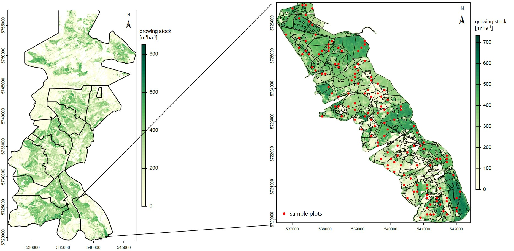

```{r setup, include=FALSE}
knitr::opts_chunk$set(echo = F, message = F, warning = F)
```

This document is used to create figures as part of the wall-to-wall modeling of the growing stock (GS).  

```{r setup script, warning=FALSE, }
source('src/setup.R', local = TRUE)
```

```{r set file paths}
ndsm_pc_path <- paste0(processed_data_dir, 'nDSMs_laz_neuhaus/')
orga_path <- paste0(raw_data_dir, 'orga/')
```

```{r data reading, results='hide'}
ndsm_pc_ctg <- lidR::readLAScatalog(ndsm_pc_path)
bi_plots <- sf::st_read(paste0(processed_data_dir, 'vol_stp_Kopie_GR_092023.gpkg'))
nlf_org <- sf::st_read(paste0(orga_path, 'NLF_Org_2022.shp'))
foa_abt <- sf::st_read(paste0(orga_path, 'foa-bb_namen_abt-uabt-ufl.shp'))
metrics_w2w <- terra::rast(paste0(output_dir, 'metrics_w2w_neuhaus.tif'))
vol_ha_pred <- terra::rast(paste0(output_dir, 'vol_ha_pred_neuhaus.tif'))
```

```{r data preparation}
# filter plots by year (2022) and forestry office (Neuhaus = 268)
bi_plots <- bi_plots[grep('268-2022-', bi_plots$key),]

# assign CRS to point clouds (ETRS89 / UTM zone 32N)
lidR::crs(ndsm_pc_ctg) <- 'EPSG:25832'

# reproject BI plots to the CRS of the point clouds
# DHDN / 3-degree Gauss-Kruger zone 3 --> ETRS89 / UTM zone 32N
bi_plots_projected <- sf::st_transform(bi_plots, sf::st_crs(25832))

# filter administrative forestry data
# by forestry office 'Neuhaus' (268)
# pick a single district ('Buchenberg' = 12) in this forestry office
# with its stand classification boundaries
fa_neuhaus <- nlf_org[nlf_org$FORSTAMT == 268,]
rev_buchenberg <- foa_abt[foa_abt$FORSTAMT == 268 & foa_abt$REVIER == 12,]

# mask zmean from the w2w metrics layer to forestry office Neuhaus
zmean_masked <- terra::mask(metrics_w2w$zmean, fa_neuhaus)

# mask the predicted GS to forestry office Neuhaus
# and set neative values to 0
vol_ha_pred_masked <- terra::mask(vol_ha_pred, fa_neuhaus)
vol_ha_pred_masked <- terra::clamp(vol_ha_pred_masked, lower = 0)

# mask the predicted GS to selected forest district
vol_ha_pred_masked_rev <- terra::mask(vol_ha_pred, rev_buchenberg)
vol_ha_pred_masked_rev <- terra::clamp(vol_ha_pred_masked_rev, lower = 0)

# intersect the plots with selected forest district
bi_plots_rev <- sf::st_intersection(bi_plots_projected, rev_buchenberg)
```

### Overview of the forestry office "Neuhaus"

The forestry office "Neuhaus" is located in the Solling, a low mountain range in southwestern Lower Saxony (Germany). Nearly 2000 sample plots (red points) are within the forestry office.

```{r plot overview of forestry office}
mapview::mapview(fa_neuhaus, map.type = c('OpenTopoMap', 'Esri.WorldImagery'),
                 alpha.regions = 0, lwd = 3, legend = F) +
mapview::mapview(bi_plots_projected, col.regions = 'red', cex = 2, legend = F)
```
\

### Mean canopy height and predicted GS

The left figure shows the mean canopy height ($m$) in the forestry office obtained from normalized point clouds. The right figure shows the predicted GS ($m^3 ha^{-1}$) based on this mean canopy height.

```{r plot zmean and predicted GS, out.width='100%'}
par(mfrow = c(1,2))
terra::plot(zmean_masked, plg = list(size=c(0.7,0.7)))
terra::plot(fa_neuhaus$geometry, alpha = 0, lwd = 1.5, add = T)
terra::plot(vol_ha_pred_masked, plg = list(size=c(0.7,0.7)),
            col = grDevices::hcl.colors(n = 50, palette = 'YlGn',
                                        rev = T))
terra::plot(fa_neuhaus$geometry, alpha = 0, lwd = 1.5, add = T)
```

```{r plot forest district with sample plots, eval=FALSE}
terra::plot(vol_ha_pred_masked_rev, ext = terra::ext(rev_buchenberg),
            plg = list(size=c(0.7,0.7)),
            col = grDevices::hcl.colors(n = 50, palette = 'YlGn',
                                        rev = T))
terra::plot(rev_buchenberg$geometry, add = T)
terra::plot(bi_plots_rev, pch = 16, cex = 0.8, col = 'red', add = T)
```

### Predicted GS in single forest districts

Of course, individual districts within the forestry office can also be viewed in more detail.

{height=100%}


